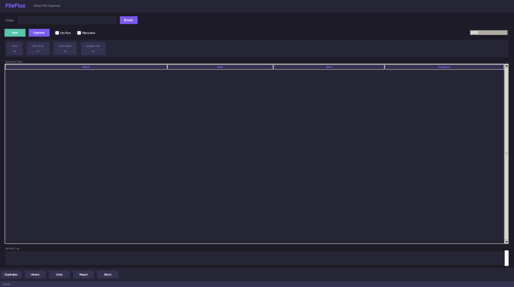
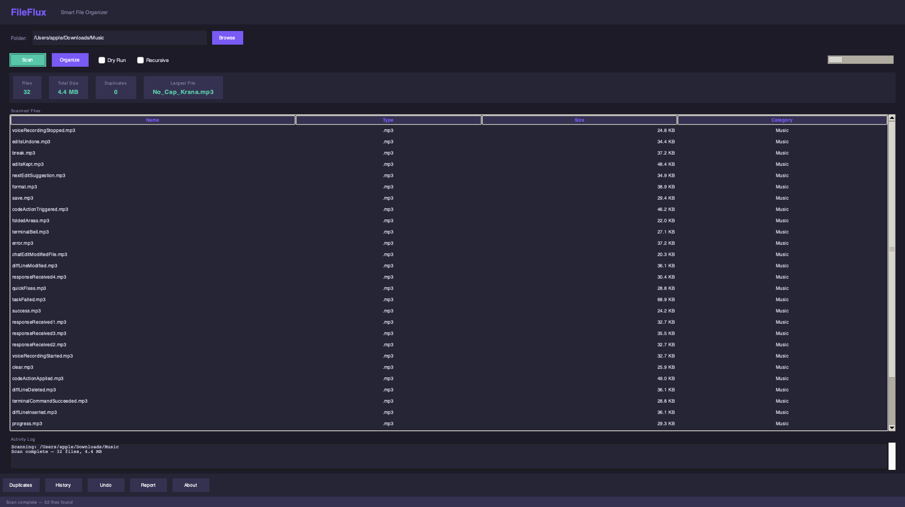

# FileFlux


A desktop file organization tool built with Python. Scan directories, organize files by type, detect duplicates, and undo operations — all from a GUI or CLI . This is tool for better organizing the directories in one click.

## Screenshots




## Features

- Recursive directory scanning
- Rule-based file organization by extension
- Duplicate detection using size-grouping + SHA-256
- SQLite operation history
- Undo last organize session
- JSON and CSV operation reports
- Dark-themed Tkinter GUI
- Full CLI with 6 subcommands
- Docker support
- GitHub Actions CI pipeline (Python 3.11, 3.12, 3.13)
- Path safety validation and protected directory checks

## Quick Start

### GUI
```bash
python3 main.py
```

### CLI
```bash
fileflux scan ~/Downloads
fileflux organize ~/Downloads
fileflux duplicates ~/Downloads
fileflux history
fileflux undo
fileflux version
```

### Docker
```bash
docker pull ghcr.io/saurav-0080/fileflux:latest
docker run --rm -v ~/Downloads:/data fileflux:1.0.0 scan /data
```

## Installation

```bash
git clone https://github.com/saurav-0080/FileFlux.git
cd FileFlux
pip install -e .
```

## Project Structure
FileFlux/
├── app/
│ ├── cli.py # CLI entry point
│ ├── scanner.py # Directory scanner
│ ├── organizer.py # File organizer
│ ├── duplicate_detector.py
│ ├── database.py # SQLite layer
│ ├── history.py # Operation history
│ ├── undo.py # Undo system
│ ├── safety.py # Path validation
│ ├── reports.py # JSON/CSV reports
│ └── gui/ # Tkinter GUI
├── tests/ # 88 passing tests
├── Dockerfile
├── .github/workflows/ci.yml
└── pyproject.toml


## Tech Stack

- Python 3.11+
- Tkinter (GUI)
- SQLite via sqlite3
- pytest + pytest-cov
- ruff (lint + format)
- Docker
- GitHub Actions

## License

MIT
